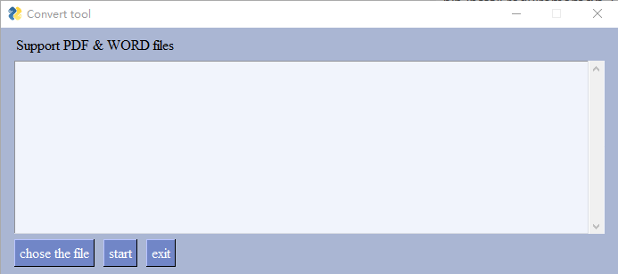
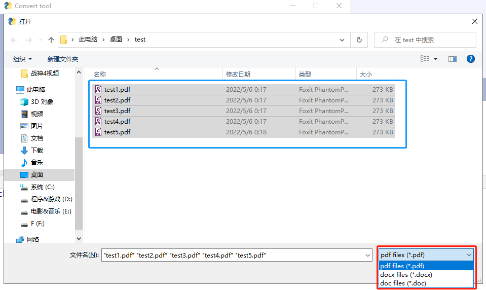
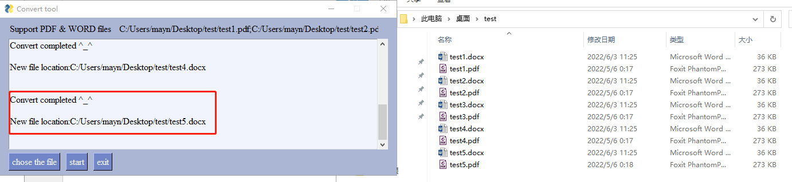

# 批量转换PDF和word文件
## Prerequisite:
国内清华大学镜像源: https://pypi.tuna.tsinghua.edu.cn/simple  
pip install requirement.txt -i https://pypi.tuna.tsinghua.edu.cn/simple  
## Guideline
#### 1.运行主程序
python3 ./PyGUI_tools/PyGUI_main.py  
运行后会显示如下界面  

#### 2.Convert tool界面教程
##### 2.1 点击chose the file  
##### 2.2 如图所示，选择需要转换的文件  
红框:选择文件类型  
蓝框:选择一个或多个文件  

##### 2.3 点击打开，然后按start开始转换 
显示转换结果和文件路径

##### 2.4 点击exit退出程序 
